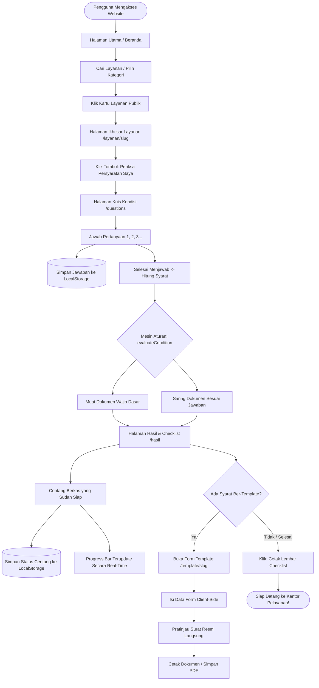

# DOKUMENTASI LENGKAP SISTEM — CEKLAYANAN (SYARATKELAR)

> **Tagline:** *"Sudah lengkap sebelum berangkat."*  
> **Repositori:** `SyaratKelar` / `CekLayanan`  
> **Versi Dokumentasi:** 1.0.0 (MVP)  
> **Terakhir Diperbarui:** September 2026

---

## DAFTAR ISI

1. [Ringkasan Eksekutif & Identitas Proyek](#1-ringkasan-eksekutif--identitas-proyek)
2. [Latar Belakang & Nilai Utama (Value Proposition)](#2-latar-belakang--nilai-utama-value-proposition)
3. [Fitur-Fitur Utama Sistem](#3-fitur-fitur-utama-sistem)
4. [Cakupan 8 Layanan Publik MVP](#4-cakupan-8-layanan-publik-mvp)
5. [Cakupan Template Surat Mandiri (Generator)](#5-cakupan-template-surat-mandiri-generator)
6. [Alur Pengguna & Alur Sistem (User & System Flows)](#6-alur-pengguna--alur-sistem-user--system-flows)
7. [Arsitektur Teknis & Struktur Kode](#7-arsitektur-teknis--struktur-kode)
8. [Prinsip Integritas Data & Privasi](#8-prinsip-integritas-data--privasi)
9. [Teknologi & Dependensi](#9-teknologi--dependensi)
10. [Panduan Menjalankan & Menambah Layanan Baru](#10-panduan-menjalankan--menambah-layanan-baru)
11. [Status Pengembangan & Roadmap](#11-status-pengembangan--roadmap)

---

## 1. RINGKASAN EKSEKUTIF & IDENTITAS PROYEK

**CekLayanan** adalah aplikasi web panduan administrasi publik mandiri yang dirancang untuk membantu masyarakat Indonesia mempersiapkan dokumen persyaratan secara tepat, runtut, dan terpersonalisasi sebelum mendatangi kantor pelayanan publik (Kelurahan, Kecamatan, Dinas Kependudukan dan Pencatatan Sipil / Disdukcapil, atau instansi terkait).

Alih-alih menyajikan daftar persyaratan statis yang panjang dan membingungkan, CekLayanan memanfaatkan **Conditional Rule Engine** berbasis jawaban singkat pemohon untuk menyaring dokumen yang benar-benar relevan dengan kasus pemohon tersebut.

### Misi Utama
> **"Mengurangi kunjungan berulang, penolakan berkas di loket akibat dokumen kurang, kebingungan bahasa birokrasi, dan mencegah praktik percaloan melalui transparansi syarat dan biaya resmi."**

### Target Audiens
* **Masyarakat Umum:** Pekerja kantoran/buruh dengan waktu terbatas yang cuti demi mengurus berkas.
* **Keluarga Muda:** Orang tua baru yang mengurus Akta Kelahiran atau pemisahan Kartu Keluarga.
* **Warga yang Berduka / Mengurus Warisan:** Warga yang perlu mengurus Akta Kematian dan Surat Keterangan Ahli Waris.
* **Pelaku Usaha Mikro & Pelajar:** Warga yang membutuhkan SKU untuk pinjaman modal usaha atau SKTM untuk pengajuan beasiswa (KIP-Kuliah/keringanan biaya).

---

## 2. LATAR BELAKANG & NILAI UTAMA (VALUE PROPOSITION)

### 2.1 Masalah Riil Masyarakat di Loket Pelayanan
1. **Informasi Tersebar & Tidak Standar:** Situs pemerintah sering kali tidak mencantumkan persyaratan yang diperbarui, atau menggunakan bahasa hukum/administrasi yang sulit dipahami orang awam.
2. **Kondisi Kasus Berbeda-beda:** Syarat pindah domisili untuk satu orang berbeda dengan seluruh keluarga; syarat akta kelahiran anak baru lahir berbeda dengan anak luar nikah atau pelaporan terlambat puluhan tahun.
3. **Fenomena "Bolak-Balik Kantor Dinas":** Warga baru mengetahui ada dokumen yang kurang setelah antre berjam-jam di loket, terpaksa pulang dan membuang waktu serta biaya transportasi.
4. **Ketidaktahuan Biaya Resmi:** Ketidaktahuan bahwa administrasi kependudukan di Indonesia adalah **GRATIS (Rp0)** membuat warga rentan dimanfaatkan oleh perantara/calo.

### 2.2 Perbandingan Alur: Sebelum vs Sesudah CekLayanan

```text
ALUR LAMA (SEBELUM ADA CEKLAYANAN):
[Cari Info Tidak Jelas] ──> [Datang ke Kantor] ──> [Antre Panjang] ──> [Loket: Berkas Kurang] ──> [Ditolak / Pulang] ──> [Ulangi Lagi Besok]

ALUR BARU (DENGAN CEKLAYANAN):
[Buka CekLayanan] ──> [Pilih Layanan & Jawab Kondisi] ──> [Dapatkan Checklist Spesifik] ──> [Centang & Cetak Mandiri] ──> [Datang Lengkap Sekali Jadi]
```

### 2.3 Prinsip Dasar Produk (Product Principles)
1. **Clarity over Complexity:** Bahasa lugas, ramah awam, bebas jargon berbelit.
2. **Accuracy over Quantity:** Lebih baik 8 layanan yang 100% tervalidasi dasar hukumnya daripada puluhan layanan dengan syarat meragukan.
3. **Official Information over Assumptions:** Setiap data bersandar pada perundang-undangan resmi (UU, Perpres, Permendagri).
4. **Useful before Impressive:** Fokus menyelesaikan masalah fungsional pengguna daripada animasi berat yang tidak perlu.
5. **Zero Data Privacy Intrusion:** Tidak ada kewajiban membuat akun/login, tidak ada pengumpulan NIK ke server, dan tidak ada formulir unggah berkas sensitif.

---

## 3. FITUR-FITUR UTAMA SISTEM

### 3.1 Mesin Persyaratan Bersyarat (Conditional Rule Engine)
Fitur inti yang mengevaluasi pertanyaan kondisi pengguna (misal: usia pemohon, lokasi peristiwa, kepemilikan buku nikah, atau cakupan kepindahan). Sistem menggabungkan:
* **Persyaratan Wajib Dasar (`baseRequirementIds`):** Dokumen yang wajib dibawa oleh semua pemohon untuk layanan tersebut.
* **Persyaratan Kondisional (`conditionalRequirementIds`):** Dokumen situasional yang hanya muncul jika jawaban pengguna memenuhi aturan (`Rule`).

### 3.2 Lembar Ceklist Interaktif (Interactive Checklist)
* Pengguna dapat menandai berkas yang sudah siap dengan mencentang kotak interaktif.
* Dilengkapi **Progress Bar & Penghitung Status Kesiapan Dokumen** (misal: "3 dari 5 Dokumen Siap").
* Status centang tersimpan secara otomatis dan aman di **LocalStorage** peramban perangkat pengguna sehingga tidak hilang saat halaman dimuat ulang.
* Tombol **Reset Centang** untuk mengosongkan status bila diperlukan.

### 3.3 Mode Cetak & Simpan PDF Siap Bawa (Printable Checklist)
* Disediakan tombol **"Cetak / Simpan PDF"** yang memanfaatkan stylesheet khusus `@media print`.
* Otomatis menyembunyikan navigasi, tombol interaksi, dan elemen visual yang tidak relevan, menghasilkan lembar cetak A4 yang rapi untuk dimasukkan ke dalam map berkas sebelum berangkat.

### 3.4 Generator Template Surat Mandiri (Document Template Generator)
* Menyediakan form pengisian formulir standar bagi surat pernyataan mandiri yang sah secara regulasi.
* Pemrosesan formulir dilakukan secara murni **Client-Side** untuk melindungi data pribadi pemohon.
* Menyediakan **Pratinjau Langsung (Live Preview)** format surat resmi dengan kop standar, identitas lengkap, klausul bersumpah, kolom materai Rp10.000, dan kolom tanda tangan saksi-saksi.
* Tombol **Cetak / Unduh Surat** langsung dari pratinjau.

### 3.5 Transparansi Biaya Resmi & Rujukan Dasar Hukum (Fee & Legal Transparency)
* Menampilkan informasi biaya resmi dengan penegasan status **"Gratis Rp0"** berdasarkan **UU No. 24 Tahun 2013 Pasal 79A**.
* Menampilkan daftar rujukan instansi penerbit, tautan situs resmi pemerintah, nomor regulasi hukum, dan tanggal verifikasi data.
* Dilengkapi kotak sangkalan (*disclaimer*) resmi bahwa CekLayanan adalah alat bantu persiapan mandiri dan keputusan berkas akhir tetap pada petugas loket resmi.

### 3.6 Pencarian & Filter Cerdas Layanan (Service Search & Category Filter)
* Filter instan pada Beranda dan Halaman Layanan berdasarkan kategori (*Kependudukan*, *Pencatatan Sipil*, *Pelayanan Kelurahan*).
* Pencarian teks bebas (*fuzzy-like matching*) terhadap nama layanan, nama alternatif (KTP-el, SKPWNI, SKU, SKTM), atau deskripsi layanan.

---

## 4. CAKUPAN 8 LAYANAN PUBLIK MVP

Berikut adalah ringkasan konfigurasi 8 layanan publik resmi yang sudah diimplementasikan penuh:

| No | Nama Layanan | Kategori | Instansi Tujuan | Biaya Resmi | Logika Kondisional Utama |
|---|---|---|---|---|---|
| 1 | **KTP Elektronik (KTP-el)** | Administrasi Kependudukan | Disdukcapil / Kecamatan / Kelurahan | **Gratis Rp0** | Membedakan: Permohonan Baru (17 tahun), Ganti Rusak, Ganti Hilang, atau Pindah Datang. |
| 2 | **Kartu Keluarga (KK)** | Administrasi Kependudukan | Disdukcapil / Kecamatan | **Gratis Rp0** | Membedakan: Pisah KK (Menikah), Tambah Anggota (Kelahiran), Pengurangan (Meninggal/Pindah), Ganti Hilang/Rusak. |
| 3 | **Surat Pindah Domisili (SKPWNI)** | Administrasi Kependudukan | Disdukcapil / Kelurahan Asal | **Gratis Rp0** | Membedakan: Pindah satu keluarga vs perorangan; Pindah dalam satu kota/kabupaten vs antar provinsi. |
| 4 | **Akta Kelahiran** | Pencatatan Sipil | Disdukcapil / Kelurahan | **Gratis Rp0** | Membedakan: Bayi baru lahir (<60 hari) vs pelaporan terlambat; Ketersediaan buku nikah orang tua (memicu SPTJM Suami-Istri); Ketiadaan surat bidan (memicu SPTJM Kelahiran). |
| 5 | **Akta Kematian** | Pencatatan Sipil | Disdukcapil / Kelurahan | **Gratis Rp0** | Membedakan: Tempat meninggal (Rumah Sakit/Faskes vs Rumah/Tempat Lain); Status kepemilikan KTP almarhum (KTP ada vs KTP hilang memicu surat kehilangan). |
| 6 | **Surat Keterangan Usaha (SKU)** | Pelayanan Kelurahan | Kantor Kelurahan / Desa | **Gratis Rp0** | Membedakan: Status lokasi tempat usaha (Milik sendiri vs sewa/kontrak); Kepemilikan bukti foto usaha & surat pengantar RT/RW. |
| 7 | **Surat Keterangan Tidak Mampu (SKTM)** | Pelayanan Kelurahan | Kelurahan / Desa & Dinas Sosial | **Gratis Rp0** | Membedakan: Tujuan permohonan (Beasiswa/Pendidikan, Jaminan Kesehatan BPJS PBI, Keringanan Hukum); Bukti kepesertaan DTKS. |
| 8 | **Surat Keterangan Ahli Waris** | Pelayanan Kelurahan | Kelurahan & Kecamatan | **Gratis Rp0** *(Biaya Materai Mandiri)* | Membedakan: Jumlah ahli waris (Satu orang vs lebih dari satu orang); Bukti penetapan silsilah keluarga dan persetujuan seluruh ahli waris. |

---

## 5. CAKUPAN TEMPLATE SURAT MANDIRI (GENERATOR)

CekLayanan menyediakan generator dokumen khusus untuk surat pernyataan mandiri yang sah secara administratif dan tidak boleh dikarang formatnya:

```text
               ┌──────────────────────────────────────────────────────────┐
               │              DAFTAR TEMPLATE RESMI DI SISTEM             │
               └────────────────────────────┬─────────────────────────────┘
                                            │
         ┌──────────────────┬───────────────┴──────────────┬──────────────────┐
         ▼                  ▼                              ▼                  ▼
┌──────────────────┐ ┌──────────────────┐ ┌──────────────────┐ ┌──────────────────┐
│  SPTJM Kelahiran │ │SPTJM Suami-Istri │ │ Pernyataan SKTM  │ │Kehilangan KTP Alm│
│ (Formulir F-2.03)│ │ (Formulir F-2.04)│ │  (Ekonomi Lemah) │ │  (Lampiran Akta) │
└──────────────────┘ └──────────────────┘ └──────────────────┘ └──────────────────┘
```

1. **SPTJM Kebenaran Data Kelahiran (`Formulir F-2.03`):**
   * *Dasar Hukum:* Permendagri No. 108 Tahun 2019 & Perpres No. 96 Tahun 2018.
   * *Kegunaan:* Surat pertanggungjawaban mutlak pengganti surat dokter/bidan bagi pengurusan Akta Kelahiran anak.
   * *Parameter Data:* Data orang tua/pemohon, identitas anak, tanggal lahir, nama 2 saksi.
2. **SPTJM Kebenaran Pasangan Suami Istri (`Formulir F-2.04`):**
   * *Dasar Hukum:* Permendagri No. 108 Tahun 2019.
   * *Kegunaan:* Bukti kebenaran ikatan perkawinan bagi pasangan yang belum memiliki buku nikah resmi saat mencatatkan akta kelahiran anak.
   * *Parameter Data:* Data suami, istri, alamat bersama, tanggal nikah, nama 2 saksi perkawinan.
3. **Surat Pernyataan Tidak Mampu Mandiri:**
   * *Dasar Hukum:* Standar Pelayanan Publik Administrasi Kelurahan / Desa.
   * *Kegunaan:* Lampiran pernyataan mandiri bermaterai mengenai tanggungan dan kondisi ekonomi sebelum SKTM dikeluarkan lurah.
   * *Parameter Data:* Data kepala keluarga, pekerjaan/penghasilan, jumlah anggota keluarga ditanggung, keperluan pembuatan.
4. **Surat Pernyataan Kehilangan KTP Almarhum:**
   * *Dasar Hukum:* Permendagri No. 108 Tahun 2019 Pasal 44.
   * *Kegunaan:* Bukti pernyataan ahli waris bermaterai jika fisik KTP almarhum/almarhumah tercecer atau hilang saat mengurus Akta Kematian.
   * *Parameter Data:* Data pelapor, hubungan ahli waris, identitas almarhum, tanggal kematian.

---

## 6. ALUR PENGGUNA & ALUR SISTEM (USER & SYSTEM FLOWS)

### 6.1 Diagram Alur Pengguna (User Journey)



### 6.2 Alur Sistem & State Management

1. **State Jawaban Pengguna (`UserAnswers`):**
   Disimpan dalam format *key-value pair*: `{ [questionId: string]: string }`. Contoh:
   ```json
   {
     "alasan_permohonan": "hilang",
     "ada_surat_polisi": "belum"
   }
   ```
2. **Evaluasi Aturan (`resolveRequirements`):**
   * Input: `service: Service`, `answers: UserAnswers`
   * Membaca `service.baseRequirementIds` $\rightarrow$ dimasukkan ke kelompok `mandatory`.
   * Melakukan iterasi terhadap setiap `Rule` pada `service.rules`.
   * Jika operator cocok (`equals`, `not_equals`, `in`), kumpulkan seluruh `requirementIds` yang terpicu.
   * Output: Objek terkelompok: `{ mandatory, conditional, all, matchedRuleIds }`.
3. **State Checklist (`ChecklistState`):**
   * Disimpan per layanan dengan kunci `ceklayanan_checklist_[serviceId]`.
   * Berisi array ID dokumen yang telah dicentang pemohon: `["ktp-asli", "surat-kehilangan-polsek"]`.
   * Hook `useLocalStorage` menangani sinkronisasi tanpa menyebabkan masalah *hydration mismatch* pada Next.js App Router (menggunakan flag `isMounted`).

---

## 7. ARSITEKTUR TEKNIS & STRUKTUR KODE

### 7.1 Arsitektur Berlapis (Layered Architecture)

Sistem dirancang dengan pemisahan tanggung jawab yang ketat (*Separation of Concerns*):

```text
┌─────────────────────────────────────────────────────────────┐
│                    PRESENTATION LAYER (UI)                  │
│       React Components, Tailwind CSS, App Router Pages      │
│  (Tidak boleh memuat logika penentuan administrasi mutlak)  │
└──────────────────────────────┬──────────────────────────────┘
                               │
                               ▼
┌─────────────────────────────────────────────────────────────┐
│                     APPLICATION LOGIC                       │
│     Custom Hooks, LocalStorage Wrappers, Validation Libs    │
└──────────────────────────────┬──────────────────────────────┘
                               │
                               ▼
┌─────────────────────────────────────────────────────────────┐
│                    CONDITIONAL RULE ENGINE                  │
│        lib/rules/engine.ts (evaluateCondition & resolve)     │
└──────────────────────────────┬──────────────────────────────┘
                               │
                               ▼
┌─────────────────────────────────────────────────────────────┐
│                      SERVICE DATA LAYER                     │
│  Data Statis Tervalidasi (data/services/items & templates)  │
└──────────────────────────────┬──────────────────────────────┘
                               │
                               ▼
┌─────────────────────────────────────────────────────────────┐
│                      PERSISTENCE LAYER                      │
│   Browser LocalStorage (Client-Side) & Supabase (Future)    │
└─────────────────────────────────────────────────────────────┘
```

### 7.2 Struktur Direktori Proyek

```text
d:/Projects/SyaratKelar/
├── docs/                        # Dokumentasi perencanaan & spesifikasi
│   ├── AGENTS.md                # Aturan coding & constraint AI Agent
│   ├── ARCHITECTURE.md          # Arsitektur sistem & data flow
│   ├── PRD.md                   # Product Requirements Document resmi
│   ├── README.md                # Ringkasan dokumentasi direktori docs
│   ├── TASKS.md                 # Daftar tugas dan pelacak fase kerja
│   ├── TECH_SPEC.md             # Spesifikasi teknis & pustaka
│   └── UI_UX.md                 # Panduan estetika, warna, & aksesibilitas
├── public/                      # Aset statis & logo
├── src/
│   ├── app/                     # Next.js App Router (Rute & Halaman)
│   │   ├── globals.css          # Styling global Tailwind CSS v4 & print CSS
│   │   ├── layout.tsx           # Layout dasar aplikasi & font Inter
│   │   ├── page.tsx             # Halaman Beranda (Hero, Search, Cara Kerja)
│   │   ├── layanan/
│   │   │   ├── page.tsx         # Katalog lengkap 8 layanan publik
│   │   │   └── [serviceId]/
│   │   │       ├── page.tsx     # Detail layanan, biaya resmi, & rujukan
│   │   │       ├── questions/   # Alur pertanyaan kondisi interaktif
│   │   │       │   └── page.tsx
│   │   │       └── hasil/       # Lembar hasil checklist & progress bar
│   │   │           └── page.tsx
│   │   ├── template/
│   │   │   ├── page.tsx         # Direktori template dokumen mandiri
│   │   │   └── [templateId]/
│   │   │       └── page.tsx     # Form pengisian template & live preview
│   │   └── tentang/
│   │       └── page.tsx         # Profil proyek, misi anti-calo, & privasi
│   ├── components/
│   │   ├── checklist/           # Komponen lembar centang dokumen
│   │   │   ├── checklist-item.tsx
│   │   │   ├── checklist-view.tsx
│   │   │   └── hasil-container.tsx
│   │   ├── layout/              # Navigasi & Footer konsisten
│   │   │   ├── navbar.tsx
│   │   │   └── footer.tsx
│   │   ├── questions/           # Komponen wizard pertanyaan
│   │   │   ├── question-card.tsx
│   │   │   └── question-wizard.tsx
│   │   ├── service/             # Kartu layanan & bar pencarian
│   │   │   ├── service-card.tsx
│   │   │   ├── service-search.tsx
│   │   │   └── service-selector.tsx
│   │   ├── template/            # Formulir generator surat & pratinjau
│   │   │   ├── template-form.tsx
│   │   │   └── template-preview.tsx
│   │   └── ui/                  # Design System Primitif Reusable
│   │       ├── alert.tsx
│   │       ├── badge.tsx
│   │       ├── button.tsx
│   │       ├── card.tsx
│   │       ├── checkbox.tsx
│   │       ├── icons.tsx
│   │       ├── input.tsx
│   │       ├── label.tsx
│   │       └── progress-bar.tsx
│   ├── data/                    # Sumber data administratif statis
│   │   ├── services/
│   │   │   ├── index.ts         # Export ringkasan & tipe layanan
│   │   │   ├── registry.ts      # Registry & pemetaan slug ke objek Service
│   │   │   └── items/           # Konfigurasi rinci 8 layanan
│   │   │       ├── akta-kelahiran.ts
│   │   │       ├── akta-kematian.ts
│   │   │       ├── kartu-keluarga.ts
│   │   │       ├── ktp.ts
│   │   │       ├── pindah-domisili.ts
│   │   │       ├── sktm.ts
│   │   │       ├── sku.ts
│   │   │       └── surat-ahli-waris.ts
│   │   └── templates/
│   │       └── index.ts         # Definisi 4 formulir template mandiri
│   ├── lib/
│   │   ├── rules/               # Mesin evaluasi aturan kondisional
│   │   │   ├── engine.ts        # evaluateCondition & resolveRequirements
│   │   │   └── engine.test.ts   # Unit test skenario logika aturan
│   │   └── storage/             # Utilitas penyimpanan lokal
│   │       ├── answerStorage.ts
│   │       ├── checklistStorage.ts
│   │       └── useStorage.ts    # Hook useLocalStorage hydration-safe
│   └── types/
│       └── index.ts             # Definisi antarmuka TypeScript lengkap
├── AGENTS.md                    # Root agent guidance
├── package.json                 # Konfigurasi dependensi npm
├── README.md                    # Dokumentasi pengantar proyek
└── tsconfig.json                # Konfigurasi TypeScript
```

### 7.3 Struktur Tipe Data Inti (`src/types/index.ts`)

```typescript
// Model Layanan Publik
export interface Service {
  id: string;
  slug: string;
  name: string;
  shortDescription: string;
  category: 'kependudukan' | 'pencatatan_sipil' | 'keterangan_kelurahan';
  categoryLabel: string;
  destinationAgency: string;     // Misal: "Disdukcapil / Kecamatan"
  estimatedTime?: string;         // Estimasi lama pengerjaan resmi
  fees: FeeInfo;                 // Transparansi biaya resmi (isFree, amount, dll)
  sources: SourceReference[];    // Rujukan hukum & tanggal verifikasi
  questions: Question[];         // Daftar kuesioner kondisi
  rules: Rule[];                 // Aturan pencocokan kondisi ke syarat
  baseRequirementIds: string[];  // Dokumen mutlak selalu wajib
  allRequirements: Requirement[];// Seluruh master dokumen yang mungkin muncul
}

// Model Aturan Kondisional (Rule)
export interface Rule {
  id: string;
  questionId: string;
  operator: 'equals' | 'not_equals' | 'in';
  value: string | string[];
  requirementIds: string[];      // ID dokumen yang diaktifkan jika kondisi cocok
}

// Model Dokumen Persyaratan
export interface Requirement {
  id: string;
  title: string;
  description?: string;
  isMandatory: boolean;
  notes?: string;
  templateAvailable?: boolean;   // Bernilai true jika ada form template mandiri
  templateId?: string;           // Rujukan ke ID template jika tersedia
}
```

---

## 8. PRINSIP INTEGRITAS DATA & PRIVASI

### 8.1 Aturan Emas Data Administratif (Zero Hallucination Rule)
* **Dilarang Mengarang Syarat & Biaya:** AI Agent maupun pengembang dilarang menambahkan dokumen, biaya, atau klausul tanpa dasar rujukan resmi.
* **Status Verifikasi:** Setiap data memiliki penanda verifikasi (`verifiedAt`). Jika data belum terkonfirmasi oleh regulasi terdaftar, statusnya wajib berupa `'NEEDS_VERIFICATION'` dan dilarang dipublikasikan sebagai fakta mutlak.
* **Transparansi Biaya:** Berpegang pada UU No. 24 Tahun 2013 Pasal 79A bahwa penerbitan dokumen administrasi kependudukan adalah **Gratis Rp0**.

### 8.2 Perlindungan Privasi Pengguna (Client-Side by Default)
1. **Tidak Ada Database Pengguna:** Sistem MVP tidak memiliki tabel akun pengguna atau kredensial login.
2. **Tidak Mengunggah File Pribadi:** Tidak ada fitur mengunggah foto KTP, Kartu Keluarga, atau dokumen identitas ke server.
3. **Penyimpanan Lokal Murni:** Status checklist dan draft isian surat hanya ada pada `localStorage` peramban milik pengguna dan tidak dikirimkan ke pihak ketiga manapun.

---

## 9. TEKNOLOGI & DEPENDENSI

* **Framework Inti:** Next.js 16 (App Router, Server Components & Client Components)
* **Bahasa:** TypeScript 5 (Strict Mode, 0% `any`)
* **Styling & UI:** Tailwind CSS v4 (Mobile-First, PostCSS engine terintegrasi)
* **Runtime React:** React 19
* **Icon System:** Custom Inline Accessible SVGs (bebas ketergantungan paket ikon pihak ketiga yang berat)
* **Penyimpanan Data Klien:** Browser LocalStorage API
* **Pencetakan / PDF:** Native Browser Print engine (`window.print()` dengan optimasi CSS `@media print` khusus formulir A4)
* **Linting & Kode:** ESLint 9 + Next.js core-web-vitals

---

## 10. PANDUAN MENJALANKAN & MENAMBAH LAYANAN BARU

### 10.1 Cara Menjalankan Proyek Secara Lokal

1. **Pasang Dependensi:**
   ```bash
   npm install
   ```
2. **Jalankan Server Pengembangan:**
   ```bash
   npm run dev
   ```
   Buka peramban di `http://localhost:3000`.

3. **Pemeriksaan Kualitas Kode:**
   ```bash
   # Type check TypeScript
   npx tsc --noEmit

   # Jalankan ESLint
   npm run lint

   # Uji Produksi Build
   npm run build
   ```

### 10.2 Cara Menambahkan Layanan Publik Baru

Sistem dirancang modular (*Extensible Architecture*). Untuk menambahkan layanan baru (misal: *Surat Keterangan Domisili Usaha* atau *Kartu Identitas Anak / KIA*), **tidak perlu mengubah komponen UI ataupun routing halaman**:

1. Buat berkas baru di `src/data/services/items/[slug-layanan].ts`.
2. Buat objek bertipe `Service` yang mendefinisikan:
   * Identitas & Kategori layanan.
   * `fees` & `sources` (dasar hukum resmi yang terverifikasi).
   * `baseRequirementIds` (dokumen wajib umum).
   * `questions` (pertanyaan situasi pemohon).
   * `rules` (pemetaan jawaban ke ID dokumen tambahan).
   * `allRequirements` (koleksi lengkap dokumen).
3. Daftarkan layanan tersebut di `src/data/services/registry.ts` pada `SERVICES_MAP`.
4. Daftarkan ringkasan layanan di `src/data/services/index.ts` pada `INITIAL_SERVICES` agar muncul otomatis pada pencarian beranda.
5. Selesai. Halaman rute dinamis Next.js (`/layanan/[serviceId]`, `/questions`, `/hasil`) akan langsung mendukung layanan tersebut secara otomatis.

---

## 11. STATUS PENGEMBANGAN & ROADMAP

### Status Terkini (MVP Complete)
* [x] **Setup & Fondasi:** Next.js 16, TypeScript, Tailwind CSS v4, Struktur Modular.
* [x] **Design System:** Tombol, Kartu, Input, Checkbox, Progress Bar, Alert, Aksesibilitas Mobile.
* [x] **Beranda & Pencarian:** Hero section, panduan alur, transparansi biaya, live search & filter kategori.
* [x] **Mesin Aturan (Rule Engine):** Kondisi equals, not_equals, in, pemecah syarat wajib vs kondisional.
* [x] **Lembar Checklist:** Interaksi centang, LocalStorage hydration-safe, progress counter, mode cetak rapi.
* [x] **8 Layanan Publik Utama:** KTP, KK, Pindah Domisili, Akta Lahir, Akta Mati, SKU, SKTM, Ahli Waris.
* [x] **Generator Template Surat:** Form input mandiri, live preview A4 standar, tombol cetak surat.
* [x] **Halaman Informasi & Transparansi:** Hak bebas calo, dasar hukum UU No. 24/2013, jaminan privasi data.

### Rencana Pengembangan Masa Depan (Post-MVP)
1. **Fitur Bookmark / Unduh Riwayat:** Ekspor ringkasan checklist ke format file `.json` atau kirim ke WhatsApp mandiri tanpa database.
2. **Ekspansi Layanan Nasional & Daerah:** Menambah layanan kepolisian (SKCK), imigrasi (Paspor), dan lokalisasi ketentuan per provinsi/kabupaten.
3. **Penyimpanan Cloud Opsional (Supabase):** Opsi login bagi pengguna yang ingin menyinkronkan status berkas antar perangkat tanpa mengurangi prinsip perlindungan privasi.
4. **Dukungan Multi-bahasa:** Menambahkan bahasa daerah utama (Jawa, Sunda) untuk semakin mempermudah kalangan lansia dan warga di pedesaan.

---

*Dokumentasi ini disusun sebagai acuan komprehensif seluruh pengembang, pemangku kepentingan, dan agen AI yang bekerja pada ekosistem proyek CekLayanan.*
